# DripOut Mobile App - High-Level Architecture Documentation

## 🎯 System Overview

DripOut is a React Native fashion discovery and recommendation platform that combines social features with AI-powered product recommendations. The app uses Firebase for backend services and a custom Python API for advanced product recommendations.

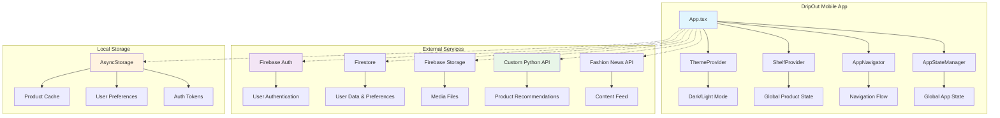

## 📱 Client-Side Architecture

### App Entry Point & Initialization Flow

The application starts with a splash screen that handles initialization in parallel:
- Theme provider setup for dark/light mode support
- Global state management through context providers
- App state manager initialization for coordination
- Data preloading for improved user experience
- API connectivity testing

### Navigation Architecture

The app uses a complex nested navigation structure:

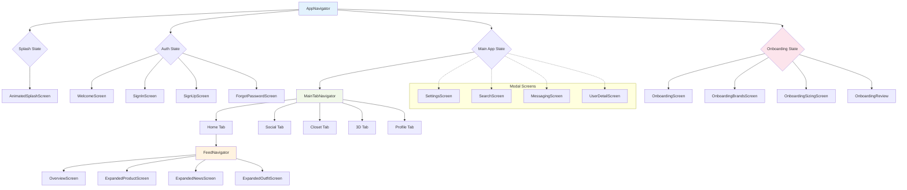

**Main Navigation States:**
- Splash State: Initial loading and initialization
- Authentication Flow: Welcome → Sign In/Sign Up → Onboarding
- Main Application: Tab-based navigation with shared element transitions

**Tab Structure:**
- Home Tab: Primary feed with product discovery
- Social Tab: User interactions and social features
- Closet Tab: Saved items and favorites
- 3D Tab: Virtual try-on and 3D visualization
- Profile Tab: User settings and preferences

**Modal Screens:**
- Settings and preferences
- Search functionality
- Messaging and notifications
- Product detail expansions

## 🔄 Core Data Flow & State Management

### State Management Architecture

The app employs a multi-layered state management approach:

**Context Providers:**
- Shelf Context: Global product shelf management
- Theme Provider: Dark/light mode coordination
- Onboarding Context: User onboarding flow state
- App State Manager: Global application state coordination

**Data Flow Pattern:**
UI Components ↔ Context/Hooks ↔ Services ↔ AsyncStorage ↔ External APIs

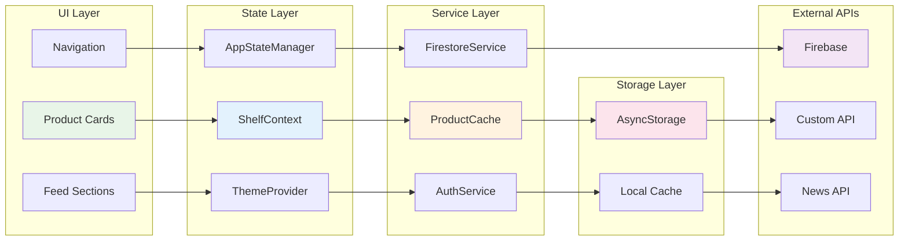

### Key State Management Patterns

**Reactive State Updates:**
- Real-time synchronization between local and remote state
- Optimistic updates for better user experience
- Conflict resolution for concurrent modifications

**State Persistence:**
- AsyncStorage for local data persistence
- Firestore for remote state synchronization
- Cache invalidation strategies for data freshness

## 🧠 Key Algorithms & Data Processing

### Product Recommendation Algorithm

The recommendation system uses a sophisticated multi-step approach:

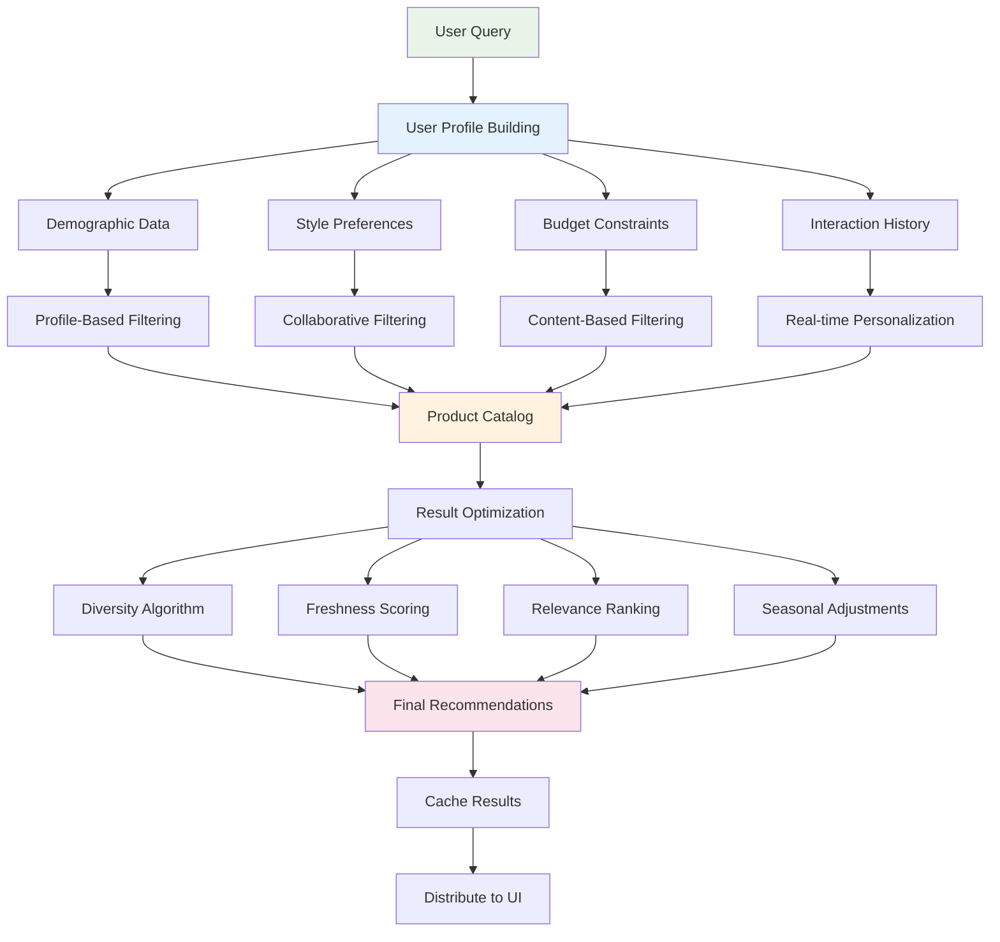

**User Profiling:**
- Demographic data collection (age, gender, body type)
- Style preferences and brand affinities
- Budget constraints and price sensitivity
- Historical interaction patterns

**Recommendation Generation:**
- Profile-based filtering of product catalog
- Collaborative filtering using similar user patterns
- Content-based filtering using product attributes
- Real-time personalization based on current session

**Result Optimization:**
- Diversity algorithms to prevent recommendation echo chambers
- Freshness scoring for new products
- Relevance ranking based on user preferences
- Seasonal and trend-based adjustments

### Multi-Section Product Distribution Algorithm

The app intelligently distributes products across different feed sections:

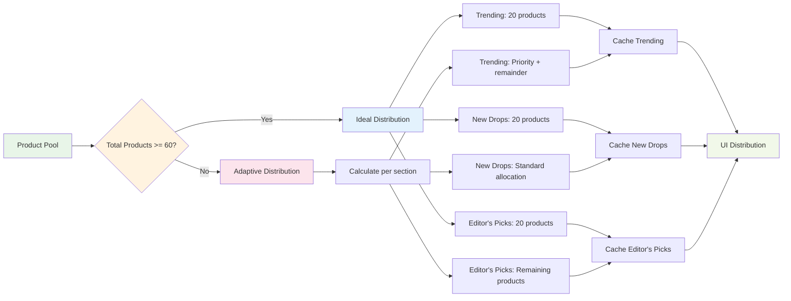

**Distribution Strategy:**
- Trending section: High-engagement, popular items
- New Drops: Recently added products with freshness scoring
- Editor's Picks: Curated selections based on quality and style

**Adaptive Distribution:**
- Dynamic allocation based on available product count
- Priority weighting for trending items
- Fallback strategies for low inventory scenarios
- User-specific section preferences

### Progressive Loading Algorithm

The app implements sophisticated progressive content loading:

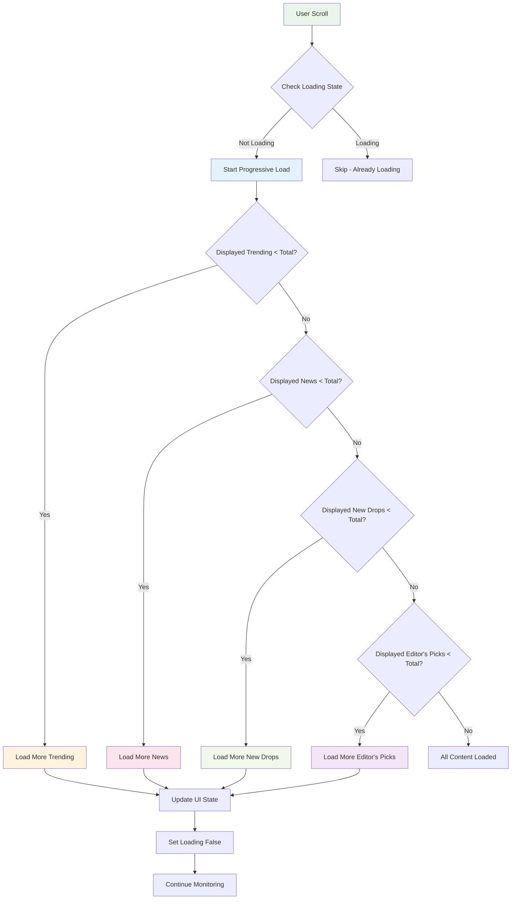

**Loading Sequence:**
- Initial load: Critical content for immediate engagement
- Progressive reveal: Additional content based on user interaction
- Background loading: Prefetching for smooth scrolling
- Lazy loading: On-demand content for performance

**Performance Optimization:**
- Viewport-based loading decisions
- Memory management for large product catalogs
- Network-aware loading strategies
- Offline content availability

## 🔌 API Integration Architecture

### Firebase Integration

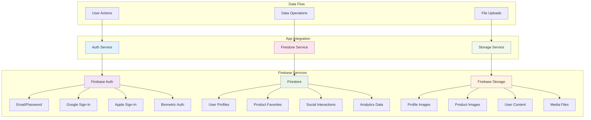

**Authentication Services:**
- Email and password authentication
- Google Sign-In integration
- Apple Sign-In for iOS users
- Biometric authentication with fallback mechanisms

**Database Services:**
- User profile management and preferences
- Product favorites and wishlist functionality
- Social interactions and user-generated content
- Analytics and usage tracking

**Storage Services:**
- Profile image management
- Product image caching and optimization
- User-generated content storage
- Media file handling and compression

### Custom Recommendation API

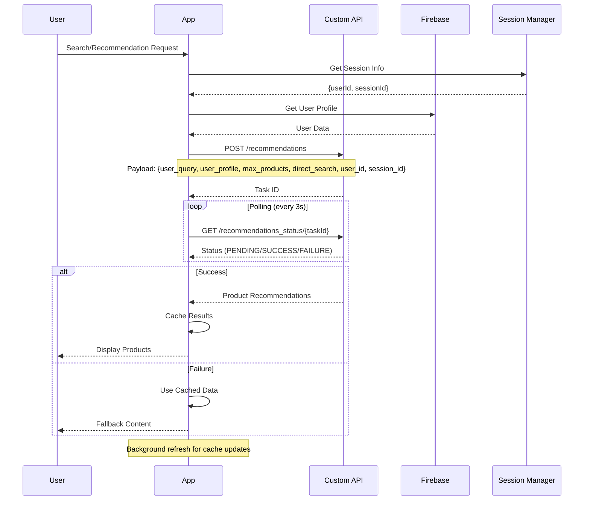

**API Endpoints:**
- Product recommendations with user profiling
- Random product discovery with personalization
- Search functionality with advanced filtering
- Health monitoring and status checking

**Request Processing:**
- Asynchronous task processing for complex recommendations
- Polling mechanisms for long-running operations
- Error handling and retry logic
- Rate limiting and request optimization

**Response Optimization:**
- Structured product data with metadata
- Image URL optimization and CDN integration
- Caching headers for improved performance
- Compression for reduced bandwidth usage

### Session Management System

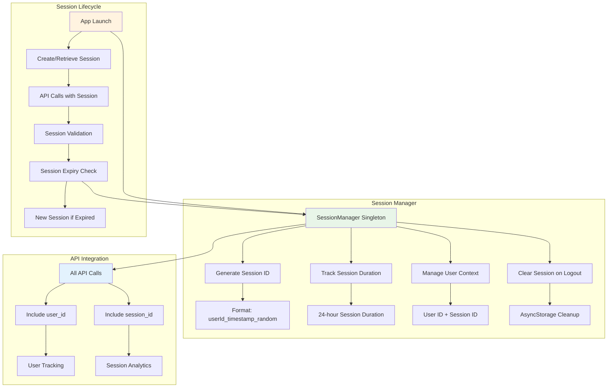

**Session Features:**
- Unique session ID generation with user context
- 24-hour session duration with automatic renewal
- Persistent session storage across app restarts
- Automatic session cleanup on user logout
- Session metadata for analytics and debugging

**API Payload Enhancement:**
- All API calls now include `user_id` and `session_id`
- Enables user behavior tracking and analytics
- Supports session-based personalization
- Facilitates debugging and support requests

### API Call Flow Patterns

**Recommendation Flow:**
- User query processing and validation
- Profile building and enhancement
- API request with comprehensive user context
- Asynchronous processing with status polling
- Result caching and distribution

**Error Handling:**
- Graceful degradation for API failures
- Fallback to cached data when available
- User-friendly error messaging
- Automatic retry mechanisms with exponential backoff

## 🗄️ Caching Strategy

### Multi-Layer Cache Architecture

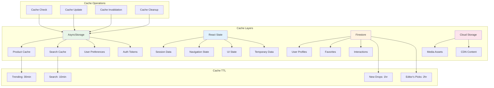

**Local Storage Layer:**
- AsyncStorage for device-local data persistence
- Product cache with time-based expiration
- Search result caching for improved performance
- User preference and setting storage

**In-Memory Cache:**
- React state for current session data
- Navigation state preservation
- UI state management
- Temporary data storage

**Remote Cache:**
- Firestore for user data synchronization
- Cloud storage for media assets
- CDN integration for static content
- Distributed caching for global performance

### Cache Invalidation Strategy

**Time-Based Expiration:**
- Trending products: 30-minute cache lifetime
- New drops: 1-hour cache lifetime
- Editor's picks: 2-hour cache lifetime
- Search results: 10-minute cache lifetime

**Event-Based Invalidation:**
- User preference changes
- New product additions
- Price updates and availability changes
- Seasonal content updates

**Smart Cache Management:**
- LRU (Least Recently Used) eviction policies
- Size-based cache limits
- Priority-based retention strategies
- Automatic cleanup for expired content

## 🔐 Authentication Flow

### Authentication State Machine

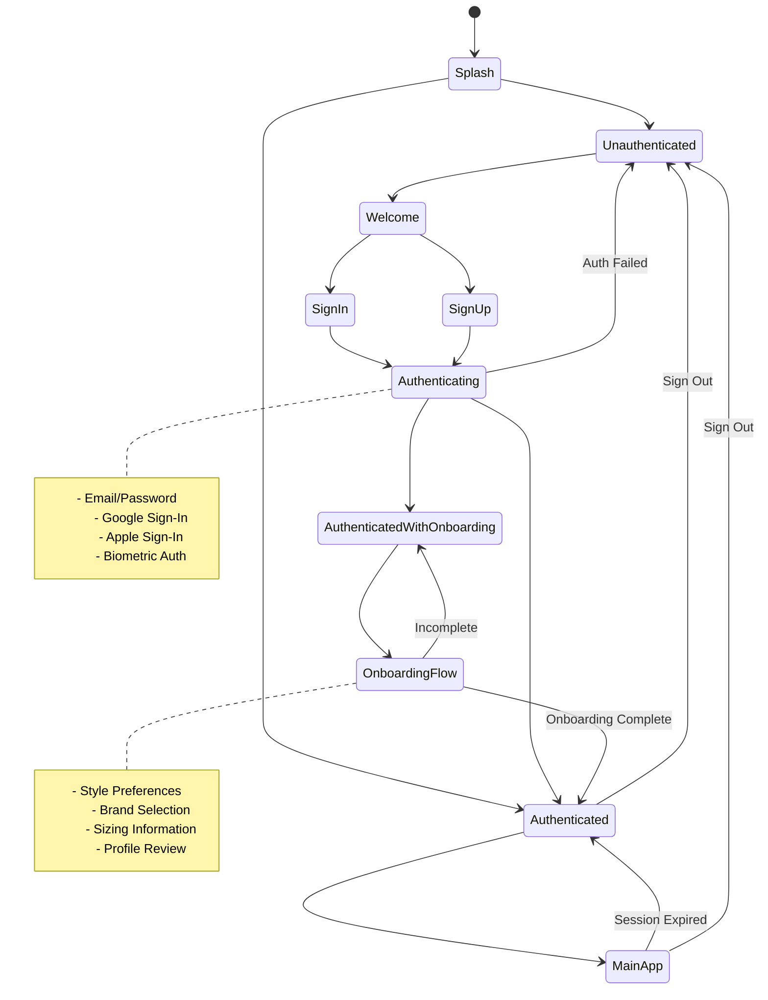

**State Transitions:**
- Unauthenticated: Welcome and sign-up flows
- Authenticating: Multi-step verification process
- Authenticated with onboarding: Profile completion flow
- Fully authenticated: Main application access

**Security Features:**
- Token-based authentication with refresh mechanisms
- Biometric authentication with secure credential storage
- Multi-factor authentication support
- Session management and timeout handling

### Biometric Authentication Algorithm

**Implementation Strategy:**
- Device capability detection and fallback planning
- Secure credential storage using device keychain
- Biometric prompt customization
- Error handling and user guidance

**Security Considerations:**
- Encrypted credential storage
- Biometric failure handling
- Fallback to traditional authentication
- Session security and timeout management

## 🎨 UI/UX Architecture

### Component Hierarchy

**Common Components:**
- Reusable UI elements for consistency
- Animated components for enhanced user experience
- Form components with validation
- Modal and overlay components

**Feature-Specific Components:**
- Product cards with unified design system
- Feed components for content display
- Navigation components for app structure
- Authentication components for user flows

**Animation System:**
- Shared element transitions for smooth navigation
- Spring-based animations for natural feel
- Performance-optimized animation rendering
- Accessibility considerations for motion sensitivity

### Design System

**Visual Consistency:**
- Unified color palette and typography
- Consistent spacing and layout patterns
- Responsive design for different screen sizes
- Dark/light mode support

**Interaction Patterns:**
- Gesture-based navigation
- Haptic feedback integration
- Accessibility features and screen reader support
- Performance monitoring and optimization

## 🚀 Performance Optimizations

### Startup Optimization

**Parallel Initialization:**
- Concurrent loading of critical resources
- Non-blocking data preloading
- Progressive enhancement of features
- Minimum splash screen duration for branding

**Resource Management:**
- Image optimization and lazy loading
- Font loading optimization
- Bundle size reduction and code splitting
- Memory management for large datasets

### Runtime Performance

**Rendering Optimization:**
- Virtualized lists for large datasets
- Memoization of expensive computations
- Efficient re-rendering strategies
- Background processing for non-critical tasks

**Network Optimization:**
- Request batching and deduplication
- Intelligent caching strategies
- Offline-first architecture
- Progressive enhancement

## 🔧 Error Handling & Resilience

### Graceful Degradation

**Failure Scenarios:**
- Network connectivity issues
- API service unavailability
- Device storage limitations
- Authentication failures

**Fallback Strategies:**
- Cached data utilization
- Offline mode functionality
- Mock data for demonstration
- User guidance and error messaging

### Monitoring and Analytics

**Performance Monitoring:**
- App startup time tracking
- Screen load time measurement
- API response time monitoring
- User interaction analytics

**Error Tracking:**
- Crash reporting and analysis
- User experience monitoring
- Performance bottleneck identification
- Proactive issue detection

## 📊 Data Flow Summary

### Primary Data Flows

```mermaid
flowchart TD
    subgraph "Product Discovery Flow"
        A1[User Scroll] --> B1[Check Cache]
        B1 --> C1{Cache Valid?}
        C1 -->|Yes| D1[Load from Cache]
        C1 -->|No| E1[API Request]
        E1 --> F1[Process Response]
        F1 --> G1[Update Cache]
        G1 --> H1[Update State]
        D1 --> H1
        H1 --> I1[Render UI]
    end
    
    subgraph "Authentication Flow"
        A2[User Input] --> B2[Validate Input]
        B2 --> C2[Firebase Auth]
        C2 --> D2[Create Profile]
        D2 --> E2[Sync State]
        E2 --> F2[Update Navigation]
    end
    
    subgraph "Recommendation Flow"
        A3[User Query] --> B3[Build Profile]
        B3 --> C3[Custom API Call]
        C3 --> D3[Async Processing]
        D3 --> E3[Cache Results]
        E3 --> F3[Distribute Content]
    end
    
    subgraph "Caching Flow"
        A4[API Response] --> B4[Validate Data]
        B4 --> C4[Store in Cache]
        C4 --> D4[Set TTL]
        D4 --> E4[Monitor Invalidation]
        E4 --> F4[Update Cache]
    end
    
    style A1 fill:#e8f5e8
    style A2 fill:#e3f2fd
    style A3 fill:#fff3e0
    style A4 fill:#fce4ec
```

**Product Discovery Flow:**
User interaction → Progressive loading → Cache validation → API request → Response processing → State update → UI rendering

**Authentication Flow:**
User input → Validation → Firebase authentication → Profile creation → State synchronization → Navigation update

**Recommendation Flow:**
User query → Profile building → Custom API request → Asynchronous processing → Result caching → Content distribution

**Caching Flow:**
API response → Data validation → Cache storage → TTL management → Invalidation triggers → Cache updates

### Data Synchronization

**Real-time Updates:**
- Firestore listeners for live data changes
- Optimistic updates for immediate feedback
- Conflict resolution for concurrent modifications
- Offline synchronization when connectivity returns

**State Consistency:**
- Single source of truth for data
- Event-driven state updates
- Transactional data modifications
- Rollback mechanisms for failed operations

## 🏗️ Architecture Benefits

### Scalability
- Modular component architecture for easy feature addition
- Service layer abstraction for backend flexibility
- Caching strategies for performance at scale
- State management patterns for complex data flows

### Maintainability
- Clear separation of concerns
- Consistent coding patterns
- Comprehensive error handling
- Extensive logging and monitoring

### User Experience
- Fast startup and loading times
- Smooth animations and transitions
- Offline functionality
- Progressive enhancement

### Developer Experience
- TypeScript for type safety
- Comprehensive documentation
- Modular architecture for team collaboration
- Testing infrastructure support

This architecture demonstrates a well-structured React Native application optimized for startup speed and user experience while maintaining scalability and maintainability for future growth. 