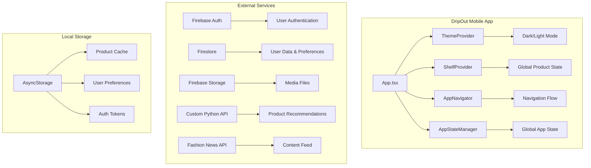

# DripOut Technical Documentation

> Comprehensive developer guide for the DripOut React Native application

## Table of Contents

- [Project Overview](#project-overview)
- [Architecture & Core Systems](#architecture--core-systems)
- [Development Setup](#development-setup)
- [Navigation Structure](#navigation-structure)
- [State Management](#state-management)
- [Service Layer Architecture](#service-layer-architecture)
- [Firebase Integration](#firebase-integration)
- [Authentication System](#authentication-system)
- [Security & Compliance](#security--compliance)
- [Performance & Caching](#performance--caching)
- [API Integration](#api-integration)
- [Development Workflow](#development-workflow)
- [Known Issues & Technical Debt](#known-issues--technical-debt)
- [Roadmap & Planned Features](#roadmap--planned-features)
- [File Structure](#file-structure)

---

## Project Overview

DripOut is a React Native fashion discovery and social commerce app that combines e-commerce, social networking, and AI-powered recommendations. The app features virtual try-on capabilities, personalized product recommendations, and a social feed for fashion content.

### Tech Stack
- **Frontend**: React Native 0.73.5 with TypeScript
- **Navigation**: React Navigation 6 with nested navigators
- **Backend**: Firebase (Auth, Firestore, Storage, Functions)
- **State Management**: Custom AppStateManager singleton
- **Styling**: Styled Components with theme support
- **External APIs**: Custom Python API for AI recommendations
- **Platform Support**: iOS 13.4+, Android API 21+

### Current Version
**v1.1.0+** with critical security fixes and performance improvements

---

## Architecture & Core Systems

### High-Level Architecture



### Core Design Patterns

**Service Layer Pattern**: All business logic encapsulated in services returning promises
```typescript
try {
  const result = await productService.getRecommendations(userId);
  return result;
} catch (error) {
  console.error('Service error:', error);
  throw error; // Let UI handle display
}
```

**Subscription-Based State Management**: Components subscribe to global state changes
```typescript
const unsubscribeAuth = appStateManager.subscribeToAuthState((authenticated) => {
  console.log('Auth state changed ->', authenticated);
  handleAuthStateChange(authenticated);
});
```

**Progressive Loading Algorithm**: Smart content loading based on user interaction
```typescript
const loadMoreContent = async () => {
  if (loading) return; // Prevent duplicate requests
  
  const nextItems = await loadNextBatch();
  setItems(prevItems => [...prevItems, ...nextItems]);
};
```

---

## Development Setup

### Commands

#### Running the App
```bash
npm start                 # Start Metro bundler
npm run ios              # Run iOS simulator
npm run android          # Run Android emulator
npm run build            # Create production bundle
```

#### Code Quality
```bash
npm run lint             # Run ESLint
npm run lint:fix         # Auto-fix ESLint issues
npm test                 # Run Jest tests (minimal coverage currently)
```

#### iOS Development
```bash
cd ios && pod install    # Install iOS dependencies
```

### Environment Variables
Create `.env` file with:
```
API_BASE_URL=your_api_endpoint
FIREBASE_API_KEY=your_firebase_key
FIREBASE_PROJECT_ID=your_project_id
```

### Firebase Configuration
Ensure these Firebase services are enabled:
- Authentication (Email, Apple, Google providers)
- Firestore Database with proper security rules
- Storage with image/video upload capabilities
- Functions for AI/ML processing

---

## Navigation Structure

### Navigation Architecture

```
AppNavigator (Root)
├── Splash Screen → Authentication Check
├── WelcomeScreen (Unauthenticated)
├── AuthNavigator (Sign in/up)
├── OnboardingNavigator (First-time setup)
└── MainTabNavigator (Main app - 5 tabs)
    ├── HomeTab → FeedNavigator
    ├── SocialTab, DiscoverTab, 3DTab, ClosetTab
    └── ProfileTab
```

### Key Navigation Files
- `src/navigations/AppNavigator.tsx` - Master navigation logic
- `src/navigations/AuthNavigator.tsx` - Authentication flow
- `src/navigations/feedNavigator/FeedNavigator.tsx` - Product feed navigation
- `src/types/NavigationTypes.ts` - Navigation type definitions

### Navigation State Machine

```typescript
enum AppState {
  SPLASH = 'splash',            // Initial splash screen
  AUTH_CHECK = 'auth_check',    // Checking authentication
  WELCOME = 'welcome',          // Welcome screen for non-authenticated users
  MAIN_APP = 'main_app',        // Main app for authenticated and guest users
  ONBOARDING = 'onboarding'     // Onboarding flow 
}
```

### Tab Structure
- **Home Tab**: Primary feed with product discovery
- **Social Tab**: User interactions and social features
- **Discover Tab**: AI-powered recommendations
- **3D Tab**: Virtual try-on and 3D visualization
- **Closet Tab**: Saved items and favorites
- **Profile Tab**: User settings and preferences

---

## State Management

### AppStateManager Architecture

The app uses a custom singleton pattern for global state management:

```typescript
class AppStateManager {
  private static instance: AppStateManager;
  private _isAuthenticated: boolean = false;
  private _isOnboarding: boolean = false;
  private _isGuestMode: boolean = false;
  private _authListeners: Array<(isAuthenticated: boolean) => void> = [];
  
  // Subscription-based updates
  public subscribeToAuthState(listener: (isAuthenticated: boolean) => void): () => void;
  public subscribeToOnboardingState(listener: (isOnboarding: boolean) => void): () => void;
}
```

#### Key State Management Features

**Authentication State**: Persistent across app launches with token validation
```typescript
// Check authentication with server validation
const isValid = await appStateManager.forceServerValidation();
if (!isValid) {
  await appStateManager.forceLogout();
}
```

**Onboarding Flow Management**: Track user progress through 4-step onboarding
```typescript
// Get completed steps from AsyncStorage/Firestore
const completedSteps = await AsyncStorage.getItem('onboardingCompletedSteps');
const incompleteSteps = allSteps.filter(step => !completedSteps.includes(step));
```

**Guest Mode Support**: Explicit guest mode activation
```typescript
// Only activated when user explicitly chooses "Continue as Guest"
appStateManager.setExplicitGuestMode(true);
```

### Context Providers

**Global State Contexts**:
- `ShelfContext` - Product shelf management
- `ThemeProvider` - Dark/light mode coordination  
- `OnboardingContext` - User onboarding flow state

**Data Flow Pattern**:
```
UI Components ↔ Context/Hooks ↔ Services ↔ AsyncStorage ↔ External APIs
```

---

## Service Layer Architecture

### Service Organization

Located in `src/services/` with 30+ specialized services:

#### Core Services
- **`firestoreService.ts`** - Database operations, user profiles (20.8KB)
- **`productService.ts`** - External API integration for products (21.7KB)
- **`recommendationService.ts`** - AI-powered product suggestions (47.2KB)
- **`authGuard.ts`** - Session validation and monitoring
- **`postService.ts`** - Social features (posts, likes, comments) (22.8KB)

#### Specialized Services
- **`productCache.ts`** - User-isolated product caching (31.9KB)
- **`messageService.ts`** - Chat and messaging functionality (24.4KB)
- **`imagePickerService.ts`** - Camera and gallery integration (16.8KB)
- **`fashionAdvisorChatService.ts`** - AI fashion advisor (13.8KB)
- **`interactionCache.ts`** - Social interaction caching
- **`rateLimitService.ts`** - API rate limiting protection

### Service Design Patterns

#### User-Isolated Caching (v1.1.0 Security Fix)
```typescript
// OLD (unsafe - could leak data between users)
await getTrendingProducts(); // Used global cache

// NEW (safe - requires user isolation)
await getTrendingProducts(false, userId); // Requires userId parameter
```

#### Error Handling Pattern
```typescript
export const serviceFunction = async (params: Type): Promise<ReturnType> => {
  try {
    const result = await externalApiCall(params);
    return result;
  } catch (error) {
    console.error('Service error:', error);
    // Log for debugging but don't break the user experience
    throw new ServiceError('User-friendly message', error);
  }
};
```

#### Retry Logic Implementation
```typescript
const executeWithRetry = async (operation: () => Promise<T>, maxRetries: number = 3): Promise<T> => {
  for (let attempt = 1; attempt <= maxRetries; attempt++) {
    try {
      return await operation();
    } catch (error) {
      if (attempt === maxRetries) throw error;
      await sleep(Math.pow(2, attempt) * 1000); // Exponential backoff
    }
  }
};
```

---

## Firebase Integration

### Services Architecture

```typescript
// Firebase Configuration
import { initializeApp } from 'firebase/app';
import { getAuth } from 'firebase/auth';
import { getFirestore } from 'firebase/firestore';
import { getStorage } from 'firebase/storage';
```

#### Authentication Services
- **Email/Password authentication**
- **Google Sign-In integration** (v1.1.0)
- **Apple Sign-In with full compliance** (v1.1.0)
- **Biometric authentication** with fallback mechanisms

#### Database Services (Firestore)
- **User profile management**: Complete user data with preferences
- **Social interactions**: Posts, likes, comments, follows
- **Product favorites**: User-specific product collections
- **Analytics tracking**: Usage patterns and engagement metrics

#### Storage Services
- **Profile images**: Automated upload and optimization
- **User-generated content**: Posts, outfit photos
- **Media compression**: Client-side optimization before upload

### Firestore Collections Structure

```typescript
// Users collection
users/{userId} = {
  userID: string;
  email: string;
  username: string;
  profilePictureURL?: string;
  onboardingCompleted: boolean;
  isAnonymizedUser?: boolean; // Apple Sign-In compliance
  // ... additional profile fields
}

// Posts collection  
posts/{postId} = {
  userId: string;
  username: string;
  content: string;
  imageUrl?: string;
  createdAt: Timestamp;
  likes: number;
  // ... social metadata
}

// User Preferences
user_preferences/{userId} = {
  preferredStyles: string[];
  preferredBrands: string[];
  topsSize: string;
  bottomsSize: string;
  shoeSize: string;
  // ... sizing and style preferences
}
```

---

## Authentication System

### Multi-Provider Authentication

#### Apple Sign-In (Fully Compliant v1.1.0)
```typescript
// Enhanced Apple authentication with security compliance
interface AppleAuthResponse {
  user: any;
  isNewUser: boolean;
  userData: {
    email: string | null;
    firstName: string | null;
    lastName: string | null;
  };
  isAnonymizedUser: boolean;      // NEW - Privacy compliance
  authorizationCode?: string;     // NEW - For token revocation
}
```

**Security Features**:
- ✅ Cryptographically secure nonce generation (equivalent to `SecRandomCopyBytes`)
- ✅ SHA256 hashing for replay attack prevention
- ✅ Authorization code capture for token revocation
- ✅ Anonymous email detection (`@privaterelay.appleid.com`)
- ✅ Complete audit trail for consent decisions

#### Authentication State Machine
```typescript
stateDiagram-v2
    [*] --> Splash
    Splash --> Unauthenticated
    Splash --> Authenticated
    
    Unauthenticated --> Welcome
    Welcome --> SignIn
    Welcome --> SignUp
    
    SignIn --> Authenticating
    SignUp --> Authenticating
    
    Authenticating --> AuthenticatedWithOnboarding
    Authenticating --> Authenticated
    Authenticating --> Unauthenticated : Auth Failed
    
    AuthenticatedWithOnboarding --> OnboardingFlow
    OnboardingFlow --> Authenticated : Onboarding Complete
    
    Authenticated --> MainApp
    Authenticated --> Unauthenticated : Sign Out
```

#### Session Management & Validation
```typescript
// Comprehensive session management (v1.1.0)
interface SessionInfo {
  sessionId: string;        // Format: userId_timestamp_random
  userId: string | null;
  sessionStartTime: number;
  sessionAge: number;
  isAuthenticated: boolean;
}

// 24-hour session duration with automatic renewal
const SESSION_DURATION = 24 * 60 * 60 * 1000;
```

**Session Features**:
- Unique session ID generation with user context
- Persistent storage across app restarts
- Automatic cleanup on user logout
- Server-side token validation every 5 minutes
- Background validation on app resume

---

## Security & Compliance

### Apple Sign-In Compliance (Production Ready)

#### Cryptographic Security
```typescript
// Secure nonce generation (src/utils/cryptoUtils.ts)
export const generateSecureNonce = (): string => {
  const charset = 'ABCDEFGHIJKLMNOPQRSTUVWXYZabcdefghijklmnopqrstuvwxyz0123456789';
  let result = '';
  for (let i = 0; i < 32; i++) {
    result += charset.charAt(Math.floor(Math.random() * charset.length));
  }
  return result;
};

// SHA256 hashing for Apple
export const sha256Hash = (input: string): string => {
  return CryptoJS.SHA256(input).toString(CryptoJS.enc.Hex);
};
```

#### Privacy Compliance
```typescript
// Anonymous email detection
export const isAppleAnonymizedEmail = (email: string): boolean => {
  return email.includes('@privaterelay.appleid.com');
};

// Consent management system
export const recordConsent = async (
  userId: string, 
  consentType: 'email' | 'phone' | 'social' | 'profile',
  consentGiven: boolean
): Promise<void> => {
  // Store consent record in Firestore with audit trail
};
```

#### Account Deletion Compliance
```typescript
// Apple-compliant account deletion
export const revokeAppleTokenAndDeleteAccount = async (
  authorizationCode: string
): Promise<void> => {
  // 1. Revoke token with Apple servers
  // 2. Delete user data from Firestore  
  // 3. Delete Firebase Auth user
  // 4. Clear local storage
};
```

### Token Security & Validation

#### Server-Side Validation
```typescript
// Force server validation (prevents token spoofing)
public async forceServerValidation(): Promise<boolean> {
  try {
    const currentUser = auth().currentUser;
    if (!currentUser) return false;
    
    // Force token refresh - will fail if user account doesn't exist
    await currentUser.getIdToken(true);
    return true;
  } catch (error) {
    console.error('Server validation failed:', error);
    return false;
  }
}
```

#### Automatic Security Monitoring
- **5-minute periodic validation** while app is active
- **Background validation** on app resume
- **Automatic logout** if validation fails
- **Session cleanup** on any security breach

---

## Performance & Caching

### Multi-Layer Caching Strategy (v1.1.0 Enhanced)

#### Cache Architecture
```typescript
// User-isolated product caching (SECURITY FIX)
const productCache = new Map<string, {
  userId: string;        // REQUIRED - prevents data leakage
  products: Product[];
  timestamp: number;
  ttl: number;
}>();

// Cache TTL Strategy
const CACHE_DURATIONS = {
  TRENDING: 30 * 60 * 1000,      // 30 minutes
  NEW_DROPS: 60 * 60 * 1000,     // 1 hour  
  EDITORS_PICKS: 2 * 60 * 60 * 1000, // 2 hours
  SEARCH: 10 * 60 * 1000,        // 10 minutes
};
```

#### Smart Cache Management
```typescript
// LRU eviction with size limits
class SmartCache<T> {
  private maxSize: number = 100;
  private cache = new Map<string, CacheEntry<T>>();
  
  set(key: string, value: T, userId: string): void {
    // Ensure user isolation
    const isolatedKey = `${userId}:${key}`;
    
    if (this.cache.size >= this.maxSize) {
      const firstKey = this.cache.keys().next().value;
      this.cache.delete(firstKey);
    }
    
    this.cache.set(isolatedKey, {
      value,
      timestamp: Date.now(),
      userId
    });
  }
}
```

### Performance Optimizations

#### FlatList Performance (v1.1.0 Fixed)
```typescript
// Enhanced social feed performance
<FlatList
  data={posts}
  renderItem={renderPost}
  keyExtractor={(item) => `${item.id}-${refreshCounter}`}
  removeClippedSubviews={true}
  initialNumToRender={10}
  maxToRenderPerBatch={10}
  windowSize={5}
  getItemLayout={(data, index) => ({
    length: ITEM_HEIGHT,
    offset: ITEM_HEIGHT * index,
    index,
  })}
/>
```

#### Interaction Preloading (v1.1.0 IMPLEMENTED)
```typescript
// Actual API preloading implementation (was just clearing cache before)
export const preloadSocialInteractions = async (userId: string): Promise<void> => {
  try {
    console.log('🚀 Preloading social interactions for user:', userId);
    
    // Parallel API calls for better performance
    await Promise.all([
      preloadUserLikes(userId),
      preloadUserSaves(userId), 
      preloadUserFollows(userId),
      preloadUserPosts(userId)
    ]);
    
    console.log('✅ Social interactions preloaded successfully');
  } catch (error) {
    console.error('❌ Error preloading social interactions:', error);
  }
};
```

#### Progressive Loading Algorithm
```typescript
// Smart content loading based on scroll position
const progressiveLoad = async (scrollY: number, contentHeight: number): Promise<void> => {
  const loadThreshold = contentHeight * 0.8; // Load when 80% scrolled
  
  if (scrollY >= loadThreshold && !isLoading) {
    setIsLoading(true);
    
    // Determine what to load next based on section completion
    const nextContent = await determineNextContent();
    await loadContent(nextContent);
    
    setIsLoading(false);
  }
};
```

---

## API Integration

### Custom Python API Integration

#### Recommendation Service Architecture
```typescript
// API payload with session tracking (v1.1.0)
interface ApiPayloadWithSession {
  user_query: string;
  user_profile: UserProfile;
  max_products: number;
  direct_search: boolean;
  user_id?: string;        // Session tracking
  session_id: string;      // Session tracking
}
```

#### Asynchronous Processing Pattern
```typescript
// Recommendation API flow
const getRecommendations = async (query: string): Promise<Product[]> => {
  // 1. Submit request
  const taskResponse = await axios.post('/recommendations', payload);
  const taskId = taskResponse.data.task_id;
  
  // 2. Poll for completion
  let status = 'PENDING';
  while (status === 'PENDING') {
    await sleep(3000); // 3-second polling interval
    const statusResponse = await axios.get(`/recommendations_status/${taskId}`);
    status = statusResponse.data.status;
  }
  
  // 3. Return results
  if (status === 'SUCCESS') {
    return statusResponse.data.products;
  } else {
    throw new Error('Recommendation failed');
  }
};
```

#### API Health Monitoring
```typescript
export const testApiConnectivity = async (): Promise<boolean> => {
  try {
    const response = await axios.get(`${API_BASE_URL}/health`, { timeout: 5000 });
    console.log('🚦 API status: ONLINE');
    return response.status === 200;
  } catch (error) {
    console.log('🚦 API status: OFFLINE');
    return false;
  }
};
```

### Rate Limiting & Error Handling

#### Intelligent Retry Logic
```typescript
// Exponential backoff with jitter
const retryWithBackoff = async <T>(
  operation: () => Promise<T>,
  maxRetries: number = 3
): Promise<T> => {
  for (let attempt = 1; attempt <= maxRetries; attempt++) {
    try {
      return await operation();
    } catch (error) {
      if (attempt === maxRetries) throw error;
      
      const baseDelay = Math.pow(2, attempt) * 1000;
      const jitter = Math.random() * 1000;
      await sleep(baseDelay + jitter);
    }
  }
};
```

#### Rate Limiting Service (v1.1.0)
```typescript
// Prevent API abuse and manage costs
class RateLimitService {
  private limits = new Map<string, RateLimit>();
  
  async checkLimit(userId: string, operation: string): Promise<boolean> {
    const key = `${userId}:${operation}`;
    const limit = this.limits.get(key);
    
    if (!limit) {
      this.limits.set(key, { count: 1, resetTime: Date.now() + 60000 });
      return true;
    }
    
    if (Date.now() > limit.resetTime) {
      limit.count = 1;
      limit.resetTime = Date.now() + 60000;
      return true;
    }
    
    if (limit.count >= MAX_REQUESTS_PER_MINUTE) {
      return false; // Rate limited
    }
    
    limit.count++;
    return true;
  }
}
```

---

## Development Workflow

### Code Quality Standards

#### TypeScript Configuration
- **Strict mode enabled** for type safety
- **Interface-driven development** for all data structures
- **Consistent error handling** with typed exceptions

#### ESLint Rules (667 warnings to address)
```bash
# Current linting status
npm run lint
# 667 problems (0 errors, 667 warnings)
# Most common: unused variables, missing dependencies
```

#### Testing Strategy (Minimal Coverage - Needs Improvement)
```bash
npm test  # Currently minimal Jest tests
```

**Priority Testing Areas**:
- Authentication flows
- State management transitions  
- API service functions
- Cache invalidation logic
- Payment processing (when added)

### Development Best Practices

#### Service Implementation Pattern
```typescript
// Template for new service files
export const newService = {
  async operation(params: OperationParams): Promise<Result> {
    try {
      // 1. Validate input parameters
      if (!params.userId) throw new Error('User ID required');
      
      // 2. Check cache first (if applicable)
      const cached = await getFromCache(params);
      if (cached) return cached;
      
      // 3. Perform operation
      const result = await externalOperation(params);
      
      // 4. Cache result (if applicable)
      await setCache(params, result);
      
      // 5. Return result
      return result;
    } catch (error) {
      console.error('Service operation failed:', error);
      throw new ServiceError('User-friendly message', error);
    }
  }
};
```

#### Component Development Pattern
```typescript
// Template for new components
interface ComponentProps {
  required: string;
  optional?: boolean;
}

export const Component: React.FC<ComponentProps> = ({ required, optional = false }) => {
  const { isDarkMode } = useTheme();
  
  // Local state
  const [state, setState] = useState<StateType>(initialState);
  
  // Effects
  useEffect(() => {
    // Setup and cleanup
    return () => {
      // Cleanup logic
    };
  }, []);
  
  // Handlers
  const handleAction = useCallback(() => {
    // Action logic
  }, [dependencies]);
  
  return (
    <StyledContainer isDarkMode={isDarkMode}>
      {/* Component JSX */}
    </StyledContainer>
  );
};
```

### Debugging Guidelines

#### Logging Standards
```typescript
// Production-safe logging (v1.1.0 fix)
const logger = {
  debug: (message: string, data?: any) => {
    if (__DEV__) console.log('🐛', message, data);
  },
  info: (message: string, data?: any) => {
    if (__DEV__) console.info('ℹ️', message, data);
  },
  error: (message: string, error?: any) => {
    // Always log errors for crash reporting
    console.error('❌', message, error);
  }
};
```

#### Performance Monitoring
```typescript
// Performance tracking for critical operations
const trackPerformance = (operation: string, fn: () => Promise<any>) => {
  const startTime = Date.now();
  
  return fn().finally(() => {
    const duration = Date.now() - startTime;
    console.log(`⏱️ ${operation} took ${duration}ms`);
  });
};
```

---

## Known Issues & Technical Debt

### Resolved Issues (v1.1.0)
- ✅ **User data isolation security issue** - Product cache now requires userId
- ✅ **Interaction preloading incomplete** - Now implements actual API calls  
- ✅ **Production logging safety** - Preserved console.error for crash reporting
- ✅ **Guest mode persistence** - Fixed state management issues
- ✅ **Apple Sign-In compliance** - Full cryptographic security implementation

### Current Technical Debt

#### High Priority (30+ Items from error_fixes.md)

**1. Authentication & Security**
- **Issue**: Insecure token storage in AsyncStorage without encryption
- **Solution**: Use react-native-keychain for encrypted storage
- **Timeline**: Critical for production

**2. Data Management** 
- **Issue**: No central state management approach
- **Solution**: Consider Redux/Zustand for complex state
- **Timeline**: Major refactor needed

**3. Testing Coverage**
- **Issue**: Almost non-existent test coverage
- **Solution**: Comprehensive unit, integration and E2E tests with 70%+ coverage
- **Timeline**: Essential before scaling

**4. Performance Optimizations**
- **Issue**: JavaScript-driven animations causing performance issues  
- **Solution**: Use Reanimated for hardware-accelerated animations
- **Timeline**: Medium priority

**5. Error Handling**
- **Issue**: Inconsistent error handling (many silently failing operations)
- **Solution**: Consistent error boundaries with user feedback
- **Timeline**: High priority for UX

#### ESLint Warnings (667 Total)
```bash
# Most common issues:
- Unused variables and imports
- Missing dependency arrays in useEffect
- Inconsistent naming conventions
- Missing TypeScript types (using 'any')
```

#### File Organization Issues
- **Confusing file names**: `ExpandedProductScreen` vs `ExpandedProductScreen2`
- **Mixed architectural patterns**: Some files use different conventions
- **Missing documentation**: Many components lack proper JSDoc comments

### Security Improvements Needed

#### Token Management
```typescript
// Current: Insecure AsyncStorage
await AsyncStorage.setItem('token', userToken);

// Needed: Encrypted keychain storage
import Keychain from 'react-native-keychain';
await Keychain.setInternetCredentials('auth', userId, userToken);
```

#### Input Validation
```typescript
// Add comprehensive input sanitization
const sanitizeInput = (input: string): string => {
  return input
    .replace(/<script\b[^<]*(?:(?!<\/script>)<[^<]*)*<\/script>/gi, '')
    .replace(/javascript:/gi, '')
    .trim();
};
```

---

## Roadmap & Planned Features

### High Priority Features (From notes.txt)

#### 1. Try-On Usage Limiting
**Goal**: Control costs and prevent abuse during closed beta
```typescript
// Planned implementation
interface TryOnLimits {
  freeTriesPerDay: number;    // 5 for free users
  resetPeriod: number;        // 12 hours after limit exceeded  
  premiumMultiplier: number;  // 10x limit for premium users
}
```

#### 2. Search & Notifications Enhancement  
**Goal**: Move search and notification buttons to far right on home page
- Add "Feature coming soon" messages for incomplete features
- Improve UI alignment and user expectations

#### 3. Social Features Enhancement
**Goal**: Allow users to see others' saved outfits, like and comment
- Optional paywall for advanced social features
- Build engagement and community

#### 4. Algorithm Improvements
**Goal**: Better feed curation based on user profile
- Product filtering system for home page  
- Improved personalization algorithms
- A/B testing for recommendation effectiveness

### Medium Priority Features

#### 1. Fashion Advisor History
- Persistent chat history with AI fashion advisor
- Conversation threading and search
- Export conversation functionality

#### 2. Continuous Loading
- Endless scrolling on overview screen
- Smart prefetching based on scroll velocity
- Improved user engagement metrics

#### 3. Enhanced Onboarding
- Show suggested followers based on onboarding choices
- Founder/team introductions
- Improved conversion rates

#### 4. Post Picture Improvements
- Better image cropping interface
- Filters and editing tools
- Batch upload functionality

### Technical Improvements Roadmap

#### Q1 2024: Security & Performance
- [ ] Implement encrypted token storage
- [ ] Add comprehensive error boundaries
- [ ] Optimize image loading and caching
- [ ] Implement proper logging service

#### Q2 2024: Testing & Quality
- [ ] Add comprehensive test suite (70% coverage target)
- [ ] Implement E2E testing with Detox
- [ ] Set up CI/CD pipeline with automated testing
- [ ] Code cleanup and refactoring

#### Q3 2024: Advanced Features
- [ ] Implement Redux/Zustand for complex state
- [ ] Add offline mode support
- [ ] Implement push notifications
- [ ] Add analytics and crash reporting

#### Q4 2024: Scale & Polish
- [ ] Performance optimization for large datasets
- [ ] Accessibility improvements
- [ ] Internationalization support
- [ ] Advanced caching strategies

---

## File Structure

### Core Architecture Files
```
src/
├── navigations/
│   ├── AppNavigator.tsx          # Master navigation logic
│   ├── AuthNavigator.tsx         # Authentication flow
│   └── feedNavigator/
│       └── FeedNavigator.tsx     # Product feed navigation
├── utils/
│   ├── appStateManager.ts        # Global state management (1.1K lines)
│   ├── sessionManager.ts         # Session tracking
│   └── cryptoUtils.ts           # Security utilities
├── types/
│   └── NavigationTypes.ts        # Navigation type definitions
└── Config/
    ├── firebaseconfig.ts         # Firebase initialization
    └── apiConfig.ts             # API endpoints
```

### Service Layer (30+ Services)
```
src/services/
├── firestoreService.ts          # Database operations (20.8KB)
├── productService.ts            # Product API integration (21.7KB)  
├── recommendationService.ts     # AI recommendations (47.2KB)
├── productCache.ts              # User-isolated caching (31.9KB)
├── messageService.ts            # Chat functionality (24.4KB)
├── postService.ts               # Social features (22.8KB)
├── imagePickerService.ts        # Camera integration (16.8KB)
├── fashionAdvisorChatService.ts # AI fashion advisor (13.8KB)
├── interactionBatchService.ts   # Social interactions (10.7KB)
├── authGuard.ts                 # Session monitoring (6.1KB)
├── rateLimitService.ts          # API protection (7.1KB)
└── auth/
    ├── appleAuthService.ts      # Apple Sign-In compliance
    ├── anonymizedAppleConsentService.ts # Privacy compliance
    └── authService.ts           # General auth operations
```

### Screen Components
```
src/screens/
├── auth/
│   ├── WelcomeScreen.tsx        # Welcome and sign-in
│   ├── SignInScreen.tsx         # Email/password sign-in
│   └── SignUpScreen.tsx         # Account creation
├── Onboarding*.tsx              # 4-step onboarding flow
├── OverviewScreen.tsx           # Main product feed
├── SocialScreen.tsx             # Social media feed  
├── 3DScreen.tsx                 # Virtual try-on
├── ClosetScreen.tsx             # Saved products
├── profiles/
│   ├── UserProfileScreen.tsx    # User profile management
│   └── SettingsScreen.tsx       # App settings
└── ExpandedFeeds/
    └── ExpandedProductScreen2.tsx # Product detail view
```

### Component Library
```
src/components/
├── common/
│   ├── AnimatedSplashScreen.tsx # App loading screen
│   ├── UnifiedProductCard.tsx   # Product display component
│   └── SuccessOptionsSheet.tsx  # Onboarding options
├── auth/
│   ├── AnonymizedAppleConsentModal.tsx # Privacy compliance
│   └── ProviderLoginModal.tsx   # Social login UI
└── feed/
    └── FeedSection.tsx          # Feed content organization
```

### Styling & Theme
```
src/styles/
├── themeprovider.tsx            # Theme context provider
├── theme/
│   ├── colors.ts               # Color definitions
│   └── textTheme.ts            # Typography system
└── GlobalStyles.ts             # Global style definitions
```

### Key Configuration Files
```
ios/
├── DripOutApp.xcodeproj/        # iOS project configuration
├── Podfile                      # CocoaPods dependencies
└── DripOutApp/
    ├── Info.plist              # iOS app configuration
    └── AppDelegate.mm           # iOS app delegate

android/
├── app/build.gradle            # Android build configuration
└── app/src/main/
    ├── AndroidManifest.xml     # Android permissions
    └── java/                   # Android-specific code

package.json                     # npm dependencies and scripts
metro.config.js                 # Metro bundler configuration
babel.config.js                 # Babel transpilation config
tsconfig.json                   # TypeScript configuration
eslint.config.mjs               # ESLint rules
```

This technical documentation serves as the single source of truth for DripOut's architecture, implementation details, and development guidelines. It consolidates information from 8+ previously scattered documentation files into one comprehensive guide.

---

*Last Updated: December 2024*  
*Version: v1.1.0+ with security and performance enhancements*